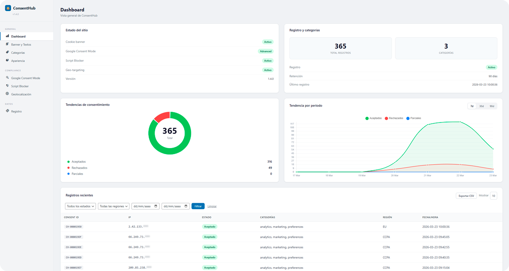

# ConsentHub

**Open-source, self-hosted cookie consent manager** for WordPress and static websites. Zero external dependencies, no SaaS, full GDPR compliance.




---

## Features

✅ **Universal Consent Engine**
- Banner + Preference Center with customizable categories
- Accept All / Reject All / Customize options
- Cookie persistence (first-party, SameSite=Lax)
- Zero dependencies, vanilla ES5 JavaScript

✅ **Google Consent Mode v2**
- Full GCM v2 support (advanced & basic modes)
- 4 required parameters: analytics_storage, ad_storage, ad_user_data, ad_personalization
- URL passthrough & ads data redaction
- Configurable category mapping

✅ **Intelligent Script Blocker**
- MutationObserver watches for injected scripts
- Pre-configured patterns: GTM, GA4, Hotjar, Clarity, Facebook Pixel, LinkedIn, TikTok, etc.
- Blocks & queues scripts until consent given
- Also blocks iframes (YouTube, Facebook, etc.)

✅ **Geolocation & Regional Rules**
- Auto-detect region via CDN headers (Cloudflare, Vercel, CloudFront, Sucuri, etc.)
- Regional rules: EU (opt-in), CCPA (opt-out), Other (hide/show)
- Manual override option

✅ **Dashboard & Analytics** *(v1.4.0)*
- Consent metrics: accepted, rejected, partial
- 7-day trend chart (Chart.js)
- CSV export with date/type/region filters
- Duplicate consent prevention (frontend + backend)
- Local database logging (no SaaS)
- IP & User-Agent hashing (non-reversible)

---

## Installation

### WordPress Plugin

1. Download `plugin-consent-hub.zip` from [Releases](https://github.com/SFernandev/WpConsentHub/releases)
2. Go to **Plugins → Add New → Upload Plugin**
3. Select `plugin-consent-hub.zip` and activate
4. Configure in **Settings → ConsentHub**

### Static Website / Non-WordPress

```html
<!DOCTYPE html>
<html>
<head>
    <link rel="stylesheet" href="vanilla/consent-hub.css">
</head>
<body>
    <script src="vanilla/consent-hub.min.js"></script>
    <script>
        ConsentHub.init({
            categories: {
                analytics: { label: 'Analytics', description: 'Usage statistics' },
                marketing: { label: 'Marketing', description: 'Ad campaigns' },
                preferences: { label: 'Preferences', description: 'Remember your choices' }
            },
            texts: {
                banner: {
                    title: 'We use cookies',
                    description: 'This site uses cookies for analytics and marketing.',
                    acceptAll: 'Accept All',
                    rejectAll: 'Reject All',
                    customize: 'Customize'
                }
            },
            gcm: {
                enabled: true,
                mode: 'advanced'
            }
        });
    </script>
</body>
</html>
```

---

## Configuration

### WordPress Admin Panel

Navigate to **Settings → ConsentHub** to configure:

- **Banner** — Position, text, button labels
- **Categories** — Add/rename consent categories
- **Styling** — Colors, borders, border radius
- **Google Consent Mode** — Enable, mode, URL passthrough, ads redaction
- **Script Blocker** — Enable, add custom patterns
- **Geolocation** — Enable, set regional rules
- **Dashboard** — Enable logging, set retention

### JavaScript API

```javascript
// Initialize
ConsentHub.init(config);

// Check consent
ConsentHub.hasConsent('analytics');  // true/false
ConsentHub.getConsent();             // { categories: {...}, timestamp: '...' }

// Show UI
ConsentHub.showBanner();
ConsentHub.showPreferences();

// Clear consent
ConsentHub.reset();

// Get detected region
ConsentHub.getRegion();              // 'eu' | 'ccpa' | 'other'

// Listen for events
ConsentHub.on('consent', function(data) {
    console.log('User gave consent:', data);
});
ConsentHub.off('consent', handler);  // Remove listener

// Version
ConsentHub.version;                  // '1.4.0'
```

---

## Architecture

```
ConsentHub = Consent Engine (JS) + Adapters per Platform

Layer 1: Consent Engine (JS vanilla)
  • consent-hub.js — Universal motor (zero dependencies)
  • consent-hub.css — Styling (CSS custom properties)

Layer 2: Platform Adapters
  • WordPress plugin (PHP) — WP Settings API, admin panel
  • HTML/JS (vanilla) — for static sites
  • React/Next/Vue — future npm package
```

### Database (WordPress)

Table: `wp_ch_consent_log` (created on activation)

| Column | Type | Purpose |
|--------|------|---------|
| id | BIGINT | Primary key |
| consent_type | VARCHAR(20) | accepted \| rejected \| partial |
| categories | VARCHAR(255) | Selected categories (JSON) |
| geo_region | VARCHAR(10) | eu \| ccpa \| other |
| ip_partial | VARCHAR(39) | Masked IP (first 3 octets) |
| ip_hash | VARCHAR(64) | SHA256 of masked IP (non-reversible) |
| user_agent_hash | VARCHAR(64) | SHA256 of masked User-Agent |
| created_at | DATETIME | UTC timestamp |

---

## Performance

| Metric | Value |
|--------|-------|
| JS File Size | ~23KB source / ~13KB minified |
| CSS Size | ~6KB source / ~4KB minified |
| Network Requests | 1 JS + 1 CSS on first load |
| Logging POST | ~200 bytes (fire-and-forget, non-blocking) |
| Dashboard Load | Admin only, <100ms DB query |

**No external calls in production** (except Google Consent Mode v2 to gtag.js, which is your choice).

---

## Development

### Project Structure

```
consent-hub/
├── vanilla/                            # Standalone engine (non-WordPress)
│   ├── consent-hub.js                  # Main engine
│   ├── consent-hub.min.js              # Minified version
│   ├── consent-hub.css                 # Styles
│   └── consent-hub.min.css             # Minified styles
│
├── wordpress/consent-hub/              # WordPress plugin source
│   ├── consent-hub.php                 # Main plugin file
│   ├── uninstall.php                   # Clean uninstall handler
│   ├── includes/
│   │   ├── class-frontend.php          # Asset enqueueing + config
│   │   ├── class-admin.php             # WP admin panel
│   │   ├── class-dashboard.php         # Metrics dashboard
│   │   ├── class-database.php          # Logging table + deduplication
│   │   ├── class-ajax.php              # Logging endpoint
│   │   ├── class-geo.php               # Geolocation detection
│   │   └── class-wp-consent.php        # WP Consent API bridge
│   ├── assets/
│   │   ├── consent-hub.js              # Engine source
│   │   ├── consent-hub.min.js          # Engine minified
│   │   ├── consent-hub.css             # Banner styles
│   │   ├── consent-hub.min.css         # Banner styles minified
│   │   ├── wp-consent-bridge.js        # WP Consent API bridge
│   │   ├── dashboard.js               # Chart.js init
│   │   ├── dashboard.css              # Dashboard styles
│   │   ├── admin.js                   # Admin panel logic
│   │   └── admin.css                  # Admin panel styles
│   └── languages/
│       ├── consent-hub.pot             # Translation template
│       ├── consent-hub-es_ES.po        # Spanish translation
│       └── consent-hub-es_ES.mo        # Spanish compiled
│
├── demo.html                           # Standalone demo
├── demo.css                            # Demo styles
├── demo.js                             # Demo logic
└── plugin-consent-hub.zip              # WordPress plugin package
```

### Building

```bash
# Minify JS
npx terser vanilla/consent-hub.js -o vanilla/consent-hub.min.js --compress --mangle

# Sync to WordPress assets
cp vanilla/consent-hub.min.js wordpress/consent-hub/assets/
cp vanilla/consent-hub.css wordpress/consent-hub/assets/

# Regenerate plugin zip (PowerShell on Windows)
cd wordpress && powershell -Command "Compress-Archive -Path 'consent-hub' -DestinationPath '../plugin-consent-hub.zip' -Force"
```

### Requirements

- **PHP:** 7.4 or higher
- **MySQL:** 5.7+ / MariaDB 10.2+
- **WordPress:** 5.0 or higher (for plugin)
- **Browser:** ES5 compatible (IE11+)
- **Dependencies:** Zero (Chart.js loaded via CDN for dashboard only)

---

## Security

✅ **No SaaS, no data collection**
- Logs stored in your own database
- IP/User-Agent hashed (non-reversible SHA256)
- No external API calls

✅ **GDPR/CCPA Compliant**
- Explicit consent required (EU)
- Opt-out option (CCPA)
- Consent records persistent
- Right to withdraw/reset

✅ **Code Security**
- No inline JavaScript execution
- Nonce validation for AJAX
- Sanitized/escaped all outputs
- No eval() or dynamic code generation

---

## License

GNU General Public License v2.0 or later — See [LICENSE](LICENSE) file.

Free for commercial use, but you must:
- Keep source code available
- Disclose modifications
- Use compatible license

---

## Changelog

### v1.4.0 (2026-03-23)
- ✨ Dashboard with consent metrics & 7-day chart
- ✨ CSV export with date, type, and region filters
- ✨ Logging system (local DB, non-reversible hashing)
- ✨ es_ES translations
- 🐛 Fix duplicate consent logging (one record per visitor)
- 🐛 Fix MySQL 5.7+ index compatibility
- 🌐 Full i18n support (WPML, Polylang, Loco Translate)
- ♻️ Externalized all inline CSS/JS (CSP-compatible)
- 🚚 Restructured project: `vanilla/` folder + `plugin-consent-hub.zip`

### v1.3.0 (2026-03-19)
- ✨ Geolocation detection (Cloudflare, Vercel, etc.)
- ✨ Regional rules (EU opt-in, CCPA opt-out, etc.)
- 🐛 Fixed WP Rocket JS delay issue

### v1.2.0
- ✨ Google Consent Mode v2 support
- 🐛 Script blocker MutationObserver improvements

### v1.1.0
- ✨ Intelligent script blocker
- ✨ Pre-configured patterns (GTM, GA4, Hotjar, etc.)

### v1.0.0
- 🎉 Initial release
- ✨ Banner, preference center, category toggles
- ✨ Cookie storage, frontend events API

---

## Support

- 📖 [Documentation](https://github.com/SFernandev/WpConsentHub/wiki)
- 🐛 [Issues](https://github.com/SFernandev/WpConsentHub/issues)

---

